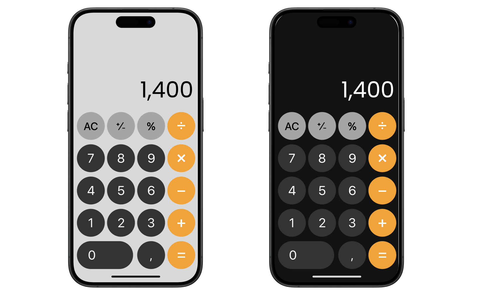

# Calculator App

### Light Mode


### Dark Mode

## 🌟 Overview
A sleek, user-friendly calculator app designed for all your basic and advanced calculation needs. With support for light and dark themes, it adapts to your preference for a comfortable and stylish experience.

---

## 🚀 Features
- **Intuitive UI**: Simple and responsive design for ease of use.
- **Basic Calculations**: Addition, subtraction, multiplication, and division.
- **Advanced Functions**: Square roots, percentages, and more.
- **Theme Support**: Light and dark modes to suit your style.
- **Real-Time Updates**: Instant results as you type.

---

## 🎯 Getting Started
Follow these steps to get the app running on your local machine.

### Prerequisites
Make sure you have the following installed:
- [Flutter](https://flutter.dev/) SDK
- A modern code editor (e.g., [VS Code](https://code.visualstudio.com/) or [Android Studio](https://developer.android.com/studio))

### Installation
1. Clone the repository:
   ```bash
   git clone https://github.com/yourusername/calculator-app.git
